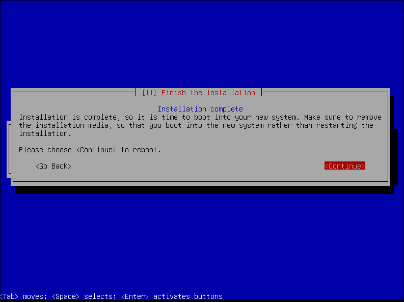
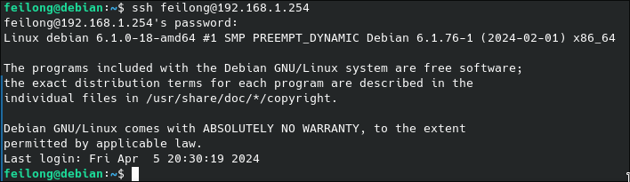
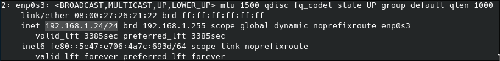
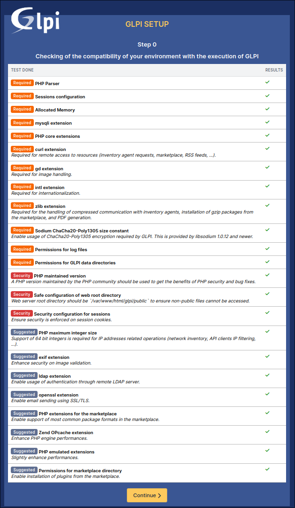
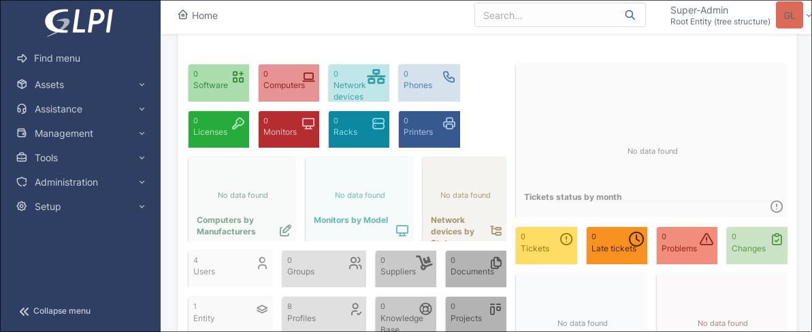

# linux-server
## Assignment
**Linux Server with:**

- DHCP server
- DNS server
- [GLPI](https://glpi-project.org/) website using [MariaDB](https://mariadb.org/)
- Weekly backup for the config files of every service
    - They are then moved to another partition
- SSH daemon

**Linux Workstation with:**

- [LibreOffice](https://www.libreoffice.org/)
- [Gimp](https://www.gimp.org/)
- [Mullvad browser](https://mullvad.net/en/browser)
- Automatic addressing via the DHCP server
- `/home` folder on a separate partition in the disk
- Solution to remotely help a user

These will be on Virtual Machines and running in an Internal Network.

## Install
For both machines, I decided to go with [Debian](https://www.debian.org/). It's a really popular distro,
known for it's stability and minimalism.

The installation process for both are essentially the same, except for two parts:

1. The installation of a desktop environment([KDE Plasma](https://kde.org/plasma-desktop/)) 
for the workstation, while the server will only be used with the command-line.


2. The separation of the `/home` directory in its own partition, also for the workstation.


The rest of the install is pretty much automatic.




## Server (192.168.1.254)
### SSH daemon
The ssh server was installed during the Debian installation process. Connecting to the server
remotely works perfectly out of the box.




### DHCP service
For the DHCP service, even though it was asked to use isc-dhcp-server, I decided to use
[Kea](https://www.isc.org/kea/) instead for two reasons:

1. Kea is the more modern successor of isc-dhcp-server.
2. isc-dhcp-server is no longer maintained[^1].

This is the DHCP server's config file in `/etc/kea/kea-dhcp4.conf`

```
# /etc/kea/kea-dhcp4.conf
{
    # DHCPv4 configuration starts on the next line
    "Dhcp4": {
        ...
        # Next we set up the interfaces to be used by the server.
        "interfaces-config": {
            "interfaces": [ "enp0s3/192.168.1.254" ]
        },

        ...

        # Finally, we list the subnets from which we will be leasing addresses.
        "subnet4": [
            {
                "id": 1,
                "subnet": "192.168.1.0/24",
                "pools": [
                    {
                        "pool": "192.168.1.2 - 192.168.1.253"
                    }
                ]
            }
        ],

        ...

        # We specify the default gateway and DNS server IP address
        "option-data":[
            {
                "name": "routers",
                "data": "192.168.1.1"
            },
            {
                "name": "domain-name-servers",
                "data": "192.168.1.254"
            },
        ]
    }
}
```

We can see that the Workstation is assigned an IP address as soon as the service
starts running. The IP address given is `192.168.1.24`, which is in the range of
the pool specified in the config file.



### DNS service

For the DNS server, I am using [Bind](https://www.isc.org/bind/)

### GLPI + MariaDB

For the website, I decided to host it with [Apache2](https://httpd.apache.org/).
After installing apache via the package manager, its service is automatically enabled.
Inserting the server address `192.168.1.254` in the browser shows the default page.

Then I installed the MariaDB that will be used by the GLPI website via the package
manager. After the database can be set up:

```
# mariadb -u root -p
MariaDB> CREATE DATABASE glpi; # create 'glpi' database
MariaDB> CREATE USER 'glpi'@'localhost' IDENTIFIED BY 'glpi'; # user 'glpi' passw 'glpi' is created
MariaDB> GRANT ALL PRIVILEGES ON mydb.* TO 'glpi'@'localhost'; # granting privileges to user 'glpi'
MariaDB> quit
```

The database is now ready to be used by GLPI, which we install next.[^2]

We first have to configure Apache VirtualHost
```
# /etc/apache2/sites-available/000-default.conf
<VirtualHost *:80>
    ServerName glpi.localhost

    DocumentRoot /var/www/html/glpi/public

    <Directory /var/www/html/glpi/public>
        Require all granted

        RewriteEngine On

        RewriteCond %{HTTP:Authorization} ^(.+)$
        RewriteRule .* - [E=HTTP_AUTHORIZATION:%{HTTP:Authorization}]

        RewriteCond %{REQUEST_FILENAME} !-f
        RewriteRule ^(.*)$ index.php [QSA,L]
    </Directory>
</VirtualHost>
```

We then have to install PHP via the package manager, as well as the following
mandatory extensions:

- `dom`, `fileinfo`, `filter`, `libxml`, `json`, `simplexml`, `xmlreader`, 
`xmlwriter`: these PHP extensions are enable by default and are used for 
various operations;
- `curl`: used for remote access to resources (inventory agent requests, marketplace, RSS feeds, …);
- `gd`: used for images handling;
- `intl`: used for internationalization;
- `mysqli`: used for database connection;
- `session`: used for sessions support;
- `zlib`: used for handling of compressed communication with inventory agents, installation of gzip packages from marketplace and PDF generation.

After that, we just download and uncompress the GLPI archive in `/var/www/html/glpi`,
and the installation wizard is displayed when browsing the default web page.
The wizard will shows every step to make the website work correctly.



After following the instructions and inputting the right infos, we have glpi service
ready to be used.




## Workstation
### Apps installation

[^1]: https://www.isc.org/dhcp/
[^2]: https://glpi-install.readthedocs.io/en/latest/prerequisites.html
