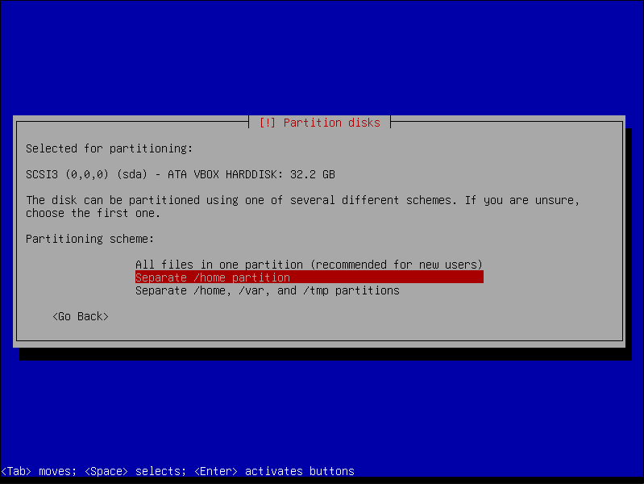

# linux-server
## Assignment
**Linux Server with:**

- DHCP server
- DNS server
- [GLPI](https://glpi-project.org/) website using [MariaDB](https://mariadb.org/)
- Weekly backup for the config files of every service
    - They are then moved to another partition
- SSH daemon

**Linux Workstation with:**

- [LibreOffice](https://www.libreoffice.org/)
- [Gimp](https://www.gimp.org/)
- [Mullvad browser](https://mullvad.net/en/browser)
- Automatic addressing via the DHCP server
- `/home` folder on a separate partition in the disk
- Solution to remotely help a user

These will be on Virtual Machines and running in an Internal Network.

## Install
For both machines, I decided to go with [Debian](https://www.debian.org/). It's a really popular distro,
known for it's stability and minimalism.

The installation process for both are essentially the same, except for two parts:

1. The installation of a desktop environment([KDE Plasma](https://kde.org/plasma-desktop/)) 
for the workstation, while the server will only be used with the command-line.

2. The separation of the `/home` directory in its own partition, also for the workstation.

## Server
### SSH daemon
### DHCP service
### DNS service
### GLPI

## Workstation
### Apps installation
